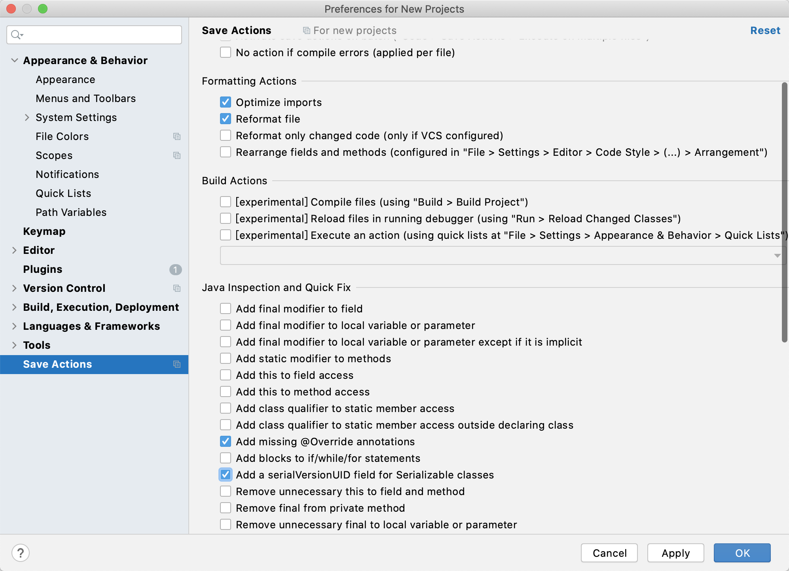

-
    1. Mac 强行退出应用快捷键： Command + Option + Esc

-
    2. Mac 打开隐藏的文件命令： Command + SHIFT + >

- 3.解决maven创建项目的时候加载特别慢

- 在maven的VM Options加上-DarchetypeCatalog=internal参数

- ```java
    -Xmx768m -DarchetypeCatalog=internal
    ```

- 4、idea中的一个子模块中的pom文件带横线、maven为灰色的解决办法

    - 解决办法：

      如果依赖都导入，可能就是idea忽略了maven模块。

      打开File-->Settings-->Maven-->Ignored Files；将“√”去掉，刷新maven即可

      可能的原因：删除该子模块后再新建一个同名的子模块，新建的子模块已经被加入了Maven的IgnoreFiles中，需要取消该勾选。

* 5、idea 2020.3 开启内存显示的方法：鼠标滑动到底栏单击右键，选中Memory Indicator即可在右下角显示内存占用情况。

* 6、markdown ☑️复选框的代码语言:

    * ```java

    - [] xxx
    ```

    - [ ] (打开源码模式可以查看)

* 7、IDEA 常用插件下载

    * 格式化工具
        * Editor->Code Style->Formatter Control 开启
        * Build,Execution-->Compiler->Annotation processing  : 开启 annotation processing Enable
    * Alibaba Java Coding Guidelines 代码规约
    * Json2Pojo
    * Pojo2Json
    * lombok 简化代码
    * Free Mybatis plugin
    * Maven Helper
    * Save Actions
        * activate save actions on save，在save的时候激活，通常是crtl+s的时候
        * add missing @Override，在actions激活的时候直接添加override（免得你以后忘记下了）
        * add a serialVersionUID，自动添加序列化id，这个在dubbo对外开放接口的时候经常会忘记，现在可以自动添加了
        * optimize imports，没有用的imports代码全部删除掉，免得以后自己按快捷键删了。。
        * 

* 查询本Mac电脑的sshKey:  ``` cat /Users/pengzhan.qian/.ssh/id_rsa.pub```

* IDEA 查看接口下的实现类快捷键： CTRL + H

* markdown的目录方式

    * ```Java
  [1.一级目录](#1)
  [1.1二级目录](#1.1)
  [1.1.1三级目录](#1.1.1)

    <h2 id='1'> 一级目录 </h2>

    <h4 id='1.1'> 二级目录 </h4>

    <h5 id='1.1.1'> 三级目录 </h5>
    链接：https://www.zhihu.com/question/21907056/answer/94041510
    ```

- JVM 发布参数：

```shell
nohup template -server -Xms2688m -Xmx2688m -Xmn960m  -XX:MaxMetaspaceSize=512M -XX:MetaspaceSize=512M -XX:SurvivorRatio=2 -XX:PermSize=96m -XX:MaxPermSize=256m -Xss256k -XX:-UseAdaptiveSizePolicy -XX:MaxTenuringThreshold=15 -XX:+DisableExplicitGC -XX:+UseConcMarkSweepGC -XX:+CMSParallelRemarkEnabled -XX:+UseCMSCompactAtFullCollection -XX:+UseFastAccessorMethods -XX:+UseCMSInitiatingOccupancyOnly -XX:+HeapDumpOnOutOfMemoryError -jar xxx.jar -DappName=xxx. -Dspring.profiles.active=prod  1>>/usr/local/logs/xxx_stdout.log 2>&1 &
```

```shell
#!/bin/bash
SERVICE_NAME=monitor
current_path=`pwd`
case "`uname`" in
    Linux)
                bin_abs_path=$(readlink -f $(dirname $0))
                ;;
        *)
                bin_abs_path=`cd $(dirname $0); pwd`
                ;;
esac
base=${bin_abs_path}/..
dos2unix $base/env
source $base/env
pid=$base/$SERVICE_NAME.pid

export JAVA_HOME
export PROFILE
export BASE=$base
##检查进程记录id
if [ -f $pid ] ; then
        echo "found "$pid" , Please run stop.sh first ,then startup.sh" 2>&2
    exit 1
fi
##设置日志路径
if [ ! -d $base/logs ] ; then
        mkdir -p $base/logs
fi

## 设置java路径
if [ -z "$JAVA" ] ; then
  JAVA=$(which template)
fi

if [ -z "$JAVA" ]; then
  if [ -f $JAVA_HOME ] ; then
        JAVA=JAVA_HOME
  else
        echo "Cannot find a Java JDK. Please set either set JAVA or put java (>=1.5) in your PATH." 2>&2
    exit 1
  fi
fi

##设置jvm参数
str=`file -L $JAVA | grep 64-bit`
if [ -n "$str" ]; then
        JAVA_OPTS="-server -Xms2688m -Xmx2688m -Xmn960m  -XX:MaxMetaspaceSize=512M -XX:MetaspaceSize=512M -XX:SurvivorRatio=2 -XX:PermSize=96m -XX:MaxPermSize=256m -Xss256k -XX:-UseAdaptiveSizePolicy -XX:MaxTenuringThreshold=15 -XX:+DisableExplicitGC -XX:+UseConcMarkSweepGC -XX:+CMSParallelRemarkEnabled -XX:+UseCMSCompactAtFullCollection -XX:+UseFastAccessorMethods -XX:+UseCMSInitiatingOccupancyOnly -XX:+HeapDumpOnOutOfMemoryError"
else
        JAVA_OPTS="-server -Xms1024m -Xmx1024m -XX:NewSize=256m -XX:MaxNewSize=256m -XX:MaxPermSize=128m "
fi

JAVA_OPTS=" $JAVA_OPTS -Djava.awt.headless=true -Djava.net.preferIPv4Stack=true -Dfile.encoding=UTF-8"
SERVICE_OPTS="-DappName=$SERVICE_NAME-Dspring.profiles.active=$PROFILE"

echo "cd to $bin_abs_path for workaround relative path"
cd $bin_abs_path
nohup template $JAVA_OPTS -jar ./$SERVICE_NAME".jar" $SERVICE_OPTS 1>>$base/logs/$SERVICE_NAME"_stdout.log" 2>&1 &
echo $! > $pid
echo "cd to $current_path for continue"
cd $current_path
```

- IDEA MD配置信息中的 add css rule:

```css
body {
    font-size: 15px;
    color: #333;
    background: #fff;
    font-family: Helvetica, Arial, "PingFang SC", "Microsoft YaHei", "WenQuanYi Micro Hei", "tohoma,sans-serif";
    margin: 0;
    padding: 10%;
}

h1 {
    font-size: 2.2em;
    font-weight: 700;
    line-height: 1.1;
    padding-top: 16px;
    margin-bottom: 4px;
}

h2, h3, h4, h5, h6 {
    line-height: 1.5em;
    margin-top: 2.2em;
    margin-bottom: 4px;
}

h2 {
    font-size: 1.4em;
    margin: 40px 10px 20px 0;
    padding-left: 9px;
    border-left: 6px solid #ff7e79;
    font-weight: 700;
    line-height: 1.4;
}

h3 {
    font-weight: 700;
    font-size: 1.2em;
    line-height: 1.4;
    margin: 10px 0 5px;
    padding-top: 10px;
}

h4 {
    font-weight: 700;
    text-transform: uppercase;
    font-size: 1.1em;
    line-height: 1.4;
    margin: 10px 0 5px;
    padding-top: 10px
}

h5, h6 {
    font-size: .9em;
}

h5 {
    font-weight: bold;
    text-transform: uppercase;
}

h6 {
    font-weight: normal;
    color: #AAA;
}

img {
    width: 100%;
    border-radius: 5px;
    display: block;
    margin-bottom: 15px;
    height: auto;
}

dl, ol, ul {
    margin-top: 12px;
    margin-bottom: 20px;
    padding-left: 5%;
    line-height: 1.8;
}

p {
    margin: 0 0 20px;
    padding: 0;
    line-height: 1.8;
}

a {
    color: #f22f27;
    text-decoration: none;
}

a:hover {
    color: #f55852;
    text-decoration: underline;
}

a:focus {
    outline-offset: -2px;
}

blockquote {
    border-left: 4px solid #42b983;
    margin: 10px 0;
    padding: 10px 0px 10px 15px;
    color: #777;
    background-color: rgba(66, 185, 131, .1);
}

strong, dfn {
    font-weight: 700;
}

em, dfn {
    font-style: italic;
    font-weight: 400;
}

del {
    text-decoration: line-through;
}

/*code {font-size:90%;}*/

/*pre {text-align:left; overflow-x: scroll; color: #257fa0; background: #f6f6f6; padding: 10pt 15pt; border-radius: 3px; border: solid 1px #e2e2e2;}*/
pre {
    margin: 0 0 10px;
    font-size: 13px;
    line-height: 1.42857;
    word-break: break-all;
    word-wrap: break-word;
    border-radius: 4px;
    white-space: pre-wrap;
    display: block;
    background: #f8f8f8;
    padding: 10px 20px;
    border: none;
    margin-bottom: 25px;
    color: #666;
    font-family: Courier, sans-serif;
}

code {
    color: #c7254e;
    background-color: #f9f2f4;
    border-radius: 4px;
    font-family: Menlo, Monaco, Consolas, "Courier New", monospace;
    padding: 2px 4px;
    font-size: 90%;
}

p > code {
    color: #c7264e;
    background-color: #f9f2f4;
    font-size: .95em;
    border-radius: 3px;
    -moz-border-radius: 3px;
    -webkit-border-radius: 3px;
}

figure {
    margin: 1em 0;
}

figcaption {
    font-size: 0.75em;
    padding: 0.5em 2em;
    margin-bottom: 2em;
}

figure img {
    margin-bottom: 0px;
}

hr {
    margin-top: 20px;
    margin-bottom: 20px;
    border: 0;
    border-top: 1px solid #eee;
}

ol p, ul p {
    margin-bottom: 0px;
}

li {
    margin-bottom: 0.75em;
    margin-top: 0.75em;
}

ol#footnotes {
    font-size: 0.95em;
    padding-top: 1em;
    margin-top: 1em;
    margin-left: 0;
    border-top: 1px solid #eaeaea;
    counter-reset: footer-counter;
    list-style: none;
    color: #555;
    padding-left: 5%;
    margin: 20px 0;
}

ol#footnotes li {
    margin-bottom: 10px;
    margin-left: 16px;
    font-weight: 400;
    line-height: 2;
    list-style-type: none;
}

ol#footnotes li:before {
    content: counter(footer-counter) ". ";
    counter-increment: footer-counter;
    font-weight: 800;
    font-size: .95em;
}

@keyframes highfade {
    0% {
        background-color: none;
    }
    20% {
        background-color: yellow;
    }
    100% {
        background-color: none;
    }
}

@-webkit-keyframes highfade {
    0% {
        background-color: none;
    }
    20% {
        background-color: yellow;
    }
    100% {
        background-color: none;
    }
}

a:target, ol#footnotes li:target, sup a:target {
    animation-name: highfade;
    animation-duration: 2s;
    animation-iteration-count: 1;
    animation-timing-function: ease-in-out;
    -webkit-animation-name: highfade;
    -webkit-animation-duration: 2s;
    -webkit-animation-iteration-count: 1;
    -webkit-animation-timing-function: ease-in-out;
}

a:target {
    border: 0;
    outline: 0;
}

animation-iteration-count:

1
;
-webkit-animation-timing-function: ease-in-out

;

}
a:target {
    border: 0;
    outline: 0;
}

tion-iteration-count:

1
;
-webkit-animation-timing-function: ease-in-out

;

}
a:target {
    border: 0;
    outline: 0;
}

table {
    padding: 0;
    border-collapse: collapse;
    border-spacing: 0;
    font-size: 1em;
    font: inherit;
    border: 0;
    margin: 0 auto;
}

tbody {
    margin: 0;
    padding: 0;
    border: 0;
}

table tr {
    border: 0;
    border-top: 1px solid #CCC;
    background-color: white;
    margin: 0;
    padding: 0;
}

table tr:nth-child(2n) {
    background-color: #F8F8F8;
}

table tr th, table tr td {
    font-size: 16px;
    border: 1px solid #CCC;
    margin: 0;
    padding: 5px 10px;
}

table tr th {
    font-weight: bold;
    border: 1px solid #ccc;
    background-color: #f8f8f8;
}
```

